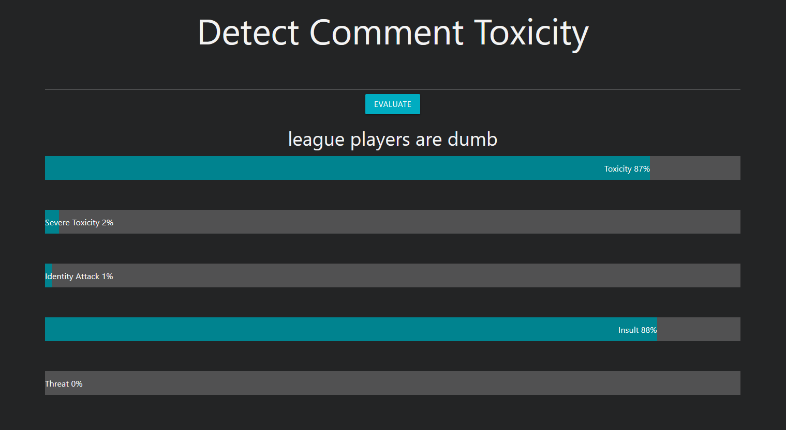

# detoxify
A scalable model that detects the level of toxicity in comments, trained on [Jigsaw's dataset](https://www.kaggle.com/c/jigsaw-unintended-bias-in-toxicity-classification/data).

# Usage
- you can pull the Docker image from docker hub by running the following command:
- `docker pull abdaloth/detoxify:latest`
- then run it with
- `docker run -p 5050:8080 detoxify:latest`
# Running Locally
1. `python3 main_local.py`
2. write the comment on the textfield in the landing page
3. alternatively: post a json payload with value `"text"` that contains the comment to `<host>:<port>/api/predict`

# Deployment on GKE
1. Create a GKE cluster
2. `kubectl apply -f ./kube/deployment.yaml`
3. `kubectl apply -f ./kube/service.yaml`

# Load Testing
1. `pip install locust`
2. `make locust host=<HOST>`
